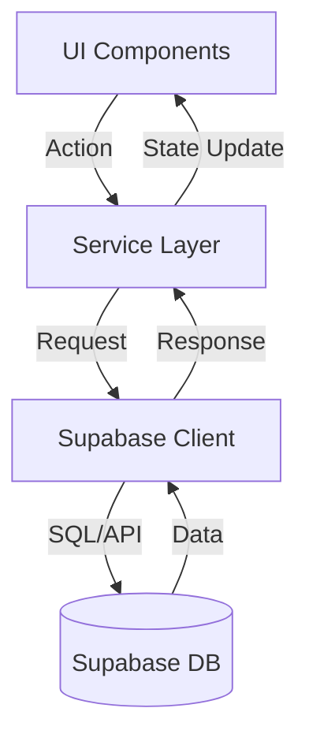

# Arquitetura do EasyTravel

## Visão Geral

O EasyTravel é uma aplicação multiplataforma (Web e Mobile) construída com React e React Native, utilizando Supabase como Backend-as-a-Service (BaaS).

## Padrões Arquiteturais

### Component-Based Architecture
A aplicação é dividida em componentes reutilizáveis e modulares, compartilhando lógica e serviços sempre que possível entre Web e Mobile.

### Client-Side Routing
- **Web**: React Router DOM
- **Mobile**: React Navigation / Expo Router

### State Management
- Gerenciamento de estado local com React Hooks (`useState`)
- Gerenciamento de Sessão/Auth com Context API (`AuthContext`)

### Backend (Supabase)
- **Database**: PostgreSQL
- **Auth**: Supabase Auth (JWT)
- **Storage**: Supabase Storage Buckets (Avatars, Covers)

## Estrutura de Diretórios (Monorepo-like)

```
easytravel/
├── web/                 # Cliente Web
│   ├── components/      # UI Components (React)
│   ├── services/        # API calls, Supabase client
│   ├── contexts/        # React Contexts (Auth)
│   └── lib/             # Utils e Configuração Supabase
├── mobile/              # Cliente Mobile (Expo)
│   ├── components/      # UI Components (React Native)
│   ├── services/        # API calls (adaptados para mobile)
│   └── lib/             # Utils e Configuração Supabase
└── doc/                 # Documentação do Projeto
```

## Fluxo de Dados (Data Flow)



## Camadas da Aplicação

### 1. Camada de Apresentação (UI)
Componentes visuais (Screens, Modals, Cards). Responsável apenas pelo display e interação local.

### 2. Camada de Serviços (Service Layer)
**Localização:** `services/api.ts`
Abstração central para chamadas ao Supabase. Contém objetos para `trips`, `users`, `storage`, permitindo fácil manutenção e testes.

### 3. Camada de Contexto (State)
**Localização:** `contexts/AuthContext.tsx`
Gerencia o estado global de autenticação (Usuário logado, Loading, Sessão).

### 4. Camada de Tipos
**Localização:** `types.ts`
Interfaces TypeScript compartilhadas (Trip, User, Expense) para garantir consistência de dados.

## Estratégia de Estilização

### Web
- **Tailwind CSS**: Classes utilitárias para rapidez e consistência.
- **Design System**: Cores e fontes centralizadas via configuração do Tailwind.

### Mobile
- **StyleSheet**: Estilização nativa do React Native.
- **Constants**: Cores e métricas centralizadas em arquivo de constantes.

## Segurança

- **RLS (Row Level Security)**: Políticas de segurança no banco de dados garantindo que usuários só acessem seus próprios dados.
- **Variáveis de Ambiente**: Chaves de API armazenadas em `.env`. completas (Welcome, TripList, NewTrip)

### Composition Pattern
Componentes menores são compostos para criar componentes maiores:
```tsx
TripListScreen
├── SegmentedControl
├── TripCard[]
├── FAB
└── BottomNav
```

## Gestão de Estado

### Estado Local (useState)
Usado para gerenciar estado de componentes individuais:
- Tab ativa (upcoming/past)
- Formulários
- Modais

### Props
Dados passados de componentes pai para filho:
- Trip data para TripCard
- Navigation functions
- User data

## Otimizações de Performance

### Code Splitting
Vite automaticamente divide o código para carregamento otimizado.

### Lazy Loading
Imagens carregadas on-demand.

### CSS Optimization
Tailwind purge remove classes não utilizadas na build de produção.

## Segurança

### Type Safety
TypeScript garante type checking em tempo de desenvolvimento.

### XSS Protection
React automaticamente escapa conteúdo renderizado.

## Pontos de Atenção

⚠️ **Estado Global:** O gerenciamento de estado complexo (além de Auth) ainda depende primariamente de prop drilling e state local. Considerar Context API expandido ou Zustand para features futuras como "Gastos".
⚠️ **Testes:** Cobertura de testes automatizados (Unitários/E2E) ainda não foi estabelecida.

## Evolução da Arquitetura

1. **Módulo de Gastos (Em breve)**
   - Criar contexto ou store para gerenciar despesas complexas
   - Sincronização offline-first (pode exigir mudanças na camada de serviço)

2. **Backend Services**
   - Refinar Policies RLS para compartilhamento de viagens (Teams/Groups)
   - Implementar Edge Functions para notificações push

3. **Qualidade**
   - Configurar pipeline de CI/CD
   - Adicionar bateria de testes jest/testing-library
