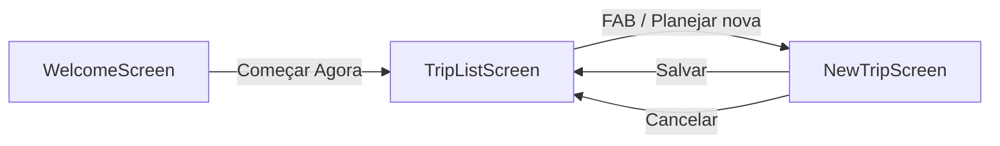

# Arquitetura do EasyTravel

## Visão Geral

O EasyTravel é uma aplicação web Single Page Application (SPA) construída com React e seguindo uma arquitetura baseada em componentes.

## Padrões Arquiteturais

### Component-Based Architecture
A aplicação é dividida em componentes reutilizáveis e modulares, cada um responsável por uma parte específica da interface.

### Client-Side Routing
Utiliza React Router DOM para navegação entre telas sem recarregar a página.

### State Management
Gerenciamento de estado local usando React Hooks (`useState`).

## Estrutura de Componentes

```
App (Root Component)
├── HashRouter
│   └── Routes
│       ├── WelcomeScreen (/)
│       ├── TripListScreen (/list)
│       └── NewTripScreen (/new)
```

## Fluxo de Navegação



## Camadas da Aplicação

### 1. Camada de Apresentação (UI)
**Localização:** `/components/`

Componentes visuais responsáveis pela interface do usuário:
- `WelcomeScreen.tsx` - Tela de boas-vindas
- `TripListScreen.tsx` - Lista de viagens
- `NewTripScreen.tsx` - Formulário de nova viagem

### 2. Camada de Roteamento
**Localização:** `App.tsx`

Gerencia a navegação entre as diferentes telas usando React Router.

### 3. Camada de Tipos
**Localização:** `types.ts`

Define interfaces TypeScript para garantir type safety:
- `Trip` - Estrutura de dados de uma viagem
- `User` - Estrutura de dados do usuário
- `AppRoute` - Enum com rotas da aplicação

### 4. Camada de Dados/Constantes
**Localização:** `constants.ts`

Armazena dados estáticos e mock:
- `IMAGES` - URLs de imagens
- `MOCK_TRIPS` - Dados de exemplo de viagens

## Estratégia de Estilização

### Tailwind CSS
Utiliza classes utilitárias do Tailwind para estilização rápida e consistente.

**Configuração personalizada:**
```javascript
{
  colors: {
    primary: "#137fec",
    "background-light": "#f6f7f8",
    "background-dark": "#101922",
    "surface-light": "#ffffff",
    "surface-dark": "#1e2a36"
  },
  fontFamily: {
    display: ["Plus Jakarta Sans", "Noto Sans", "sans-serif"],
    body: ["Plus Jakarta Sans", "Noto Sans", "sans-serif"]
  }
}
```

### Dark Mode
Suporte nativo através da classe `dark:` do Tailwind.

### Mobile-First
Design responsivo com container max-width de 448px (max-w-md) para simular app mobile.

## Padrões de Design

### Atomic Design
- **Atoms:** Botões, inputs, ícones
- **Molecules:** Cards de viagem, itens de navegação
- **Organisms:** Header, lista de viagens, calendário
- **Templates:** Layouts de tela completa
- **Pages:** Screens completas (Welcome, TripList, NewTrip)

### Composition Pattern
Componentes menores são compostos para criar componentes maiores:
```tsx
TripListScreen
├── Header
├── SegmentedControl
├── TripCard[]
├── FAB
└── BottomNav
```

## Gestão de Estado

### Estado Local (useState)
Usado para gerenciar estado de componentes individuais:
- Tab ativa (upcoming/past)
- Formulários
- Modais

### Props
Dados passados de componentes pai para filho:
- Trip data para TripCard
- Navigation functions
- User data

## Otimizações de Performance

### Code Splitting
Vite automaticamente divide o código para carregamento otimizado.

### Lazy Loading
Imagens carregadas on-demand.

### CSS Optimization
Tailwind purge remove classes não utilizadas na build de produção.

## Segurança

### Type Safety
TypeScript garante type checking em tempo de desenvolvimento.

### XSS Protection
React automaticamente escapa conteúdo renderizado.

## Limitações Atuais

⚠️ **Dados Mock:** Atualmente utiliza dados estáticos
⚠️ **Sem Backend:** Não há persistência de dados
⚠️ **Sem Autenticação:** Não implementado
⚠️ **Estado Global:** Não utiliza state management library (Redux, Zustand)

## Próximos Passos

1. Implementar backend (Supabase/Firebase)
2. Adicionar state management global
3. Implementar autenticação
4. Converter para React Native
5. Adicionar testes automatizados
