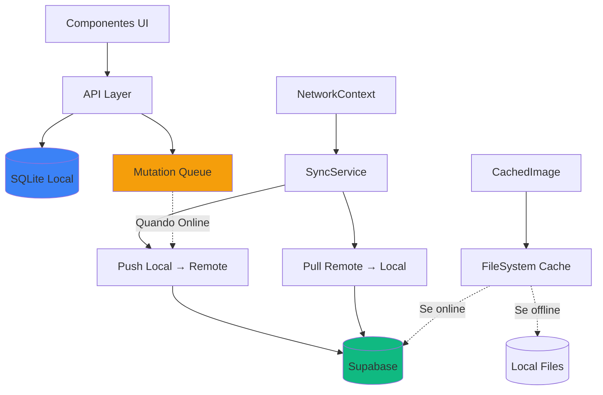
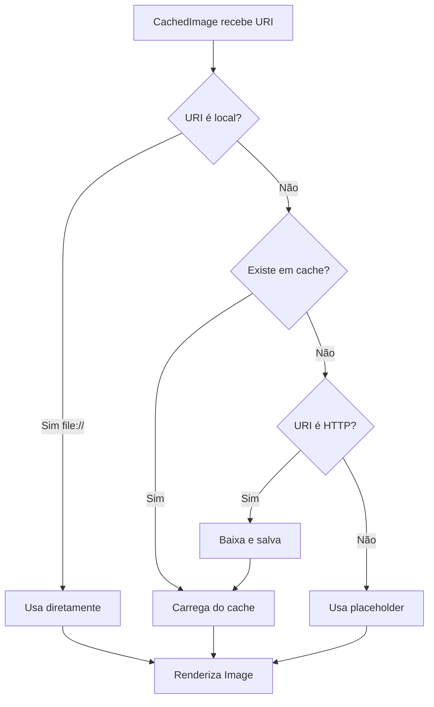
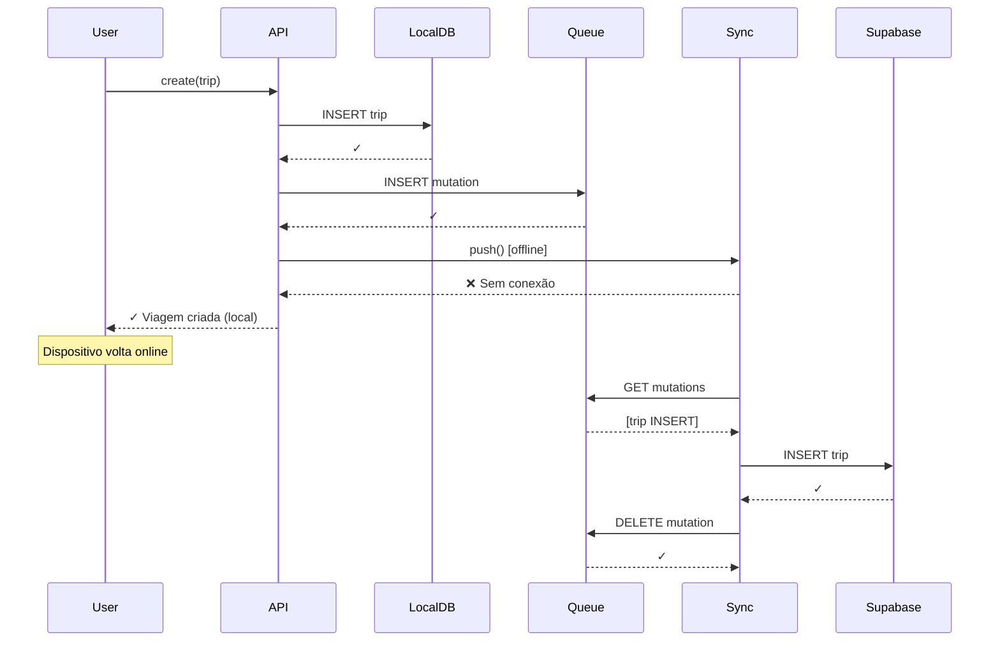
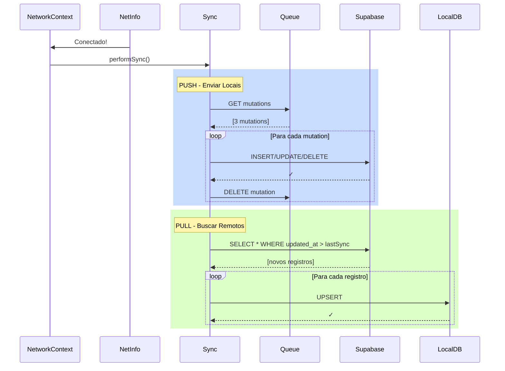
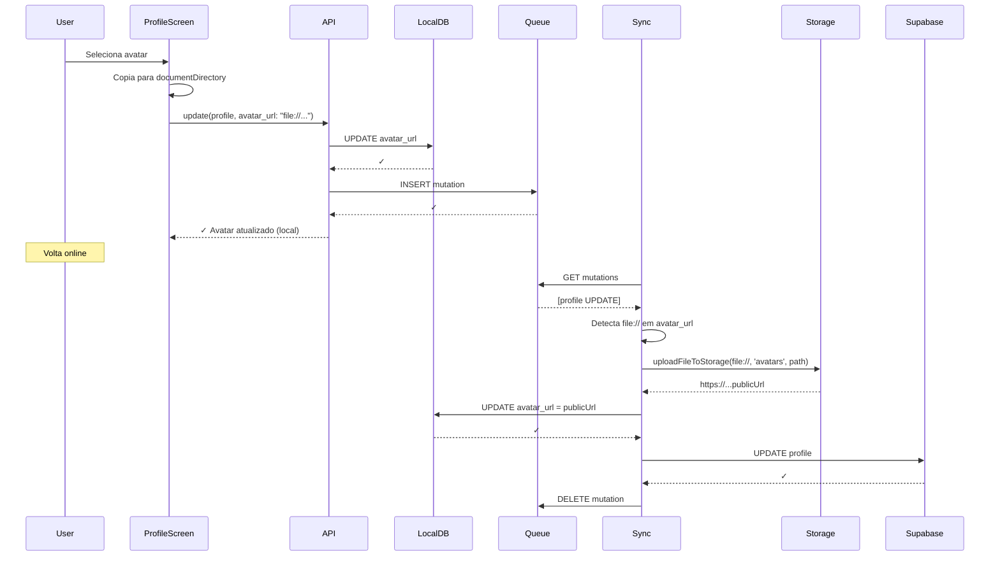

# Sistema de Cache Offline - EasyTravel Mobile

Este documento apresenta a arquitetura completa do sistema de cache offline implementado no aplicativo mobile EasyTravel, incluindo sincronização de dados, cache de imagens e estratégias offline-first.

---

## 📋 Índice

1. [Arquitetura Geral](#arquitetura-geral)
2. [Componentes do Sistema](#componentes-do-sistema)
3. [Fluxo de Sincronização](#fluxo-de-sincronização)
4. [Cache de Imagens](#cache-de-imagens)
5. [Guia de Testes](#guia-de-testes)
6. [Expo Go vs Build Standalone](#expo-go-vs-build-standalone)
7. [Solução de Problemas](#solução-de-problemas)

---

## 🏗️ Arquitetura Geral

O sistema implementa uma **estratégia offline-first** com sincronização bidirecional:



### Princípios Fundamentais

1. **Offline-First**: Todas as operações são gravadas localmente primeiro
2. **Sincronização Automática**: Quando a conexão é restaurada, dados são sincronizados
3. **Cache de Imagens**: Imagens são baixadas e armazenadas localmente para acesso offline
4. **Fila de Mutações**: Alterações offline são enfileiradas e processadas quando online

---

## 🧩 Componentes do Sistema

### 1. NetworkContext (`contexts/NetworkContext.tsx`)

Gerencia o estado de conectividade e orquestra a sincronização.

**Responsabilidades:**
- Monitora conectividade de rede em tempo real
- Inicializa banco de dados local na montagem
- Dispara sincronização automática ao voltar online
- Fornece função manual de sincronização

**API Exposta:**
```typescript
interface NetworkContextType {
    isConnected: boolean | null;  // Estado da conexão
    syncNow: () => Promise<void>;  // Sincronização manual
    checkConnectivity: () => Promise<boolean>;  // Verificação de conectividade
    isSyncing: boolean;  // Indicador de sincronização em andamento
}
```

**Fluxo de Inicialização:**
```typescript
// 1. Inicializa DB
await initDB();

// 2. Verifica conectividade
const state = await NetInfo.fetch();

// 3. Sincroniza se online (não bloqueante)
if (state.isConnected) {
    performSync().catch(e => console.log('Sync inicial falhou'));
}
```

**Sincronização Automática:**
```typescript
// Monitora mudanças de rede
NetInfo.addEventListener(state => {
    const wasOffline = isConnected === false;
    const nowOnline = state.isConnected === true;
    
    // Auto-sync quando volta online
    if (wasOffline && nowOnline) {
        performSync();
    }
});
```

---

### 2. Local Database (`services/localDb.ts`)

Banco de dados SQLite local que espelha o schema do Supabase.

**Tabelas Principais:**

#### `trips`
```sql
CREATE TABLE trips (
    id TEXT PRIMARY KEY,
    destination TEXT NOT NULL,
    start_date TEXT NOT NULL,
    end_date TEXT NOT NULL,
    image_url TEXT,
    status TEXT NOT NULL,
    description TEXT,
    budget REAL,
    user_id TEXT NOT NULL,
    created_at TEXT,
    updated_at TEXT,
    is_synced INTEGER DEFAULT 1
);
```

#### `expenses`
```sql
CREATE TABLE expenses (
    id TEXT PRIMARY KEY,
    trip_id TEXT NOT NULL,
    amount REAL NOT NULL,
    category TEXT NOT NULL,
    description TEXT NOT NULL,
    date TEXT NOT NULL,
    user_id TEXT NOT NULL,
    created_at TEXT,
    updated_at TEXT,
    is_synced INTEGER DEFAULT 1,
    FOREIGN KEY (trip_id) REFERENCES trips (id) ON DELETE CASCADE
);
```

#### `memories`
```sql
CREATE TABLE memories (
    id TEXT PRIMARY KEY,
    trip_id TEXT NOT NULL,
    image_url TEXT NOT NULL,
    caption TEXT,
    location TEXT,
    taken_at TEXT,
    user_id TEXT NOT NULL,
    created_at TEXT,
    updated_at TEXT,
    is_synced INTEGER DEFAULT 1,
    FOREIGN KEY (trip_id) REFERENCES trips (id) ON DELETE CASCADE
);
```

#### `profiles`
```sql
CREATE TABLE profiles (
    id TEXT PRIMARY KEY,
    name TEXT,
    avatar_url TEXT,
    created_at TEXT,
    updated_at TEXT,
    is_synced INTEGER DEFAULT 1
);
```

#### `mutation_queue` (Fila de Sincronização)
```sql
CREATE TABLE mutation_queue (
    id INTEGER PRIMARY KEY AUTOINCREMENT,
    table_name TEXT NOT NULL,
    action TEXT NOT NULL,  -- INSERT, UPDATE, DELETE
    data TEXT NOT NULL,     -- JSON string do registro
    record_id TEXT NOT NULL,
    created_at TEXT DEFAULT (datetime('now'))
);
```

#### `sync_state` (Estado de Sincronização)
```sql
CREATE TABLE sync_state (
    table_name TEXT PRIMARY KEY,
    last_synced_at TEXT  -- Última sincronização bem-sucedida
);
```

---

### 3. API Layer (`services/api.ts`)

Camada intermediária que abstrai operações locais/remotas.

**Padrão de Gravação Otimista:**

```typescript
const optimisticWrite = async (
    table: string,
    action: 'INSERT' | 'UPDATE' | 'DELETE',
    data: any,
    recordId: string,
    sqlQuery: string,
    sqlParams: any[]
) => {
    // 1. Gravação Local IMEDIATA
    await db.runAsync(sqlQuery, sqlParams);
    
    // 2. Adiciona à Fila de Mutações
    await queueMutation(table, action, recordId, data);
    
    // 3. Tenta Sincronizar (se online)
    if (await isOnline()) {
        SyncService.push();  // Não bloqueante
    }
};
```

**Exemplo de Uso - Criar Viagem:**
```typescript
async create(trip: TripInsert) {
    const id = generateUUID();
    const newTrip = {
        ...trip,
        id,
        created_at: new Date().toISOString(),
        updated_at: new Date().toISOString(),
        status: trip.status || 'planning'
    };
    
    await optimisticWrite(
        'trips',
        'INSERT',
        newTrip,
        id,
        `INSERT INTO trips (...) VALUES (...)`,
        [id, newTrip.destination, ...]
    );
    
    return newTrip;  // Retorna imediatamente
}
```

---

### 4. Sync Service (`services/syncService.ts`)

Gerencia sincronização bidirecional entre SQLite local e Supabase.

#### Pull (Remoto → Local)

```typescript
async pullTable(tableName: string) {
    // 1. Obter última hora de sincronização
    const lastSyncedAt = await getLastSync(tableName);
    
    // 2. Buscar registros novos/atualizados do Supabase
    const { data } = await supabase
        .from(tableName)
        .select('*')
        .gt('updated_at', lastSyncedAt);
    
    // 3. Upsert no Banco Local
    for (const row of data) {
        await db.runAsync(
            `INSERT INTO ${tableName} (...)
             VALUES (...)
             ON CONFLICT(id) DO UPDATE SET ...`,
            values
        );
    }
    
    // 4. Atualizar estado de sincronização
    await updateSyncState(tableName, new Date().toISOString());
}
```

#### Push (Local → Remoto)

```typescript
async push() {
    // 1. Obter mutações pendentes
    const mutations = await db.getAllAsync(
        'SELECT * FROM mutation_queue ORDER BY created_at ASC'
    );
    
    // 2. Processar cada mutação
    for (const mutation of mutations) {
        let payload = JSON.parse(mutation.data);
        
        // 2a. Upload de imagens locais (file://)
        if (payload.image_url?.startsWith('file://')) {
            const publicUrl = await uploadFileToStorage(
                payload.image_url,
                bucket,
                fileName
            );
            
            if (publicUrl) {
                payload.image_url = publicUrl;
                // Atualiza também no banco local
                await db.runAsync(
                    `UPDATE ${table_name} SET image_url = ? WHERE id = ?`,
                    [publicUrl, record_id]
                );
            }
        }
        
        // 2b. Executar ação no Supabase
        if (action === 'INSERT') {
            await supabase.from(table_name).insert(payload);
        } else if (action === 'UPDATE') {
            await supabase.from(table_name).update(payload).eq('id', record_id);
        } else if (action === 'DELETE') {
            await supabase.from(table_name).delete().eq('id', record_id);
        }
        
        // 3. Remover da fila em caso de sucesso
        await db.runAsync('DELETE FROM mutation_queue WHERE id = ?', [mutation.id]);
    }
}
```

#### Sincronização de Exclusões

```typescript
async pullDeletions(tableName: string) {
    // 1. Buscar IDs remotos
    const { data: remoteData } = await supabase.from(tableName).select('id');
    const remoteIds = new Set(remoteData.map(r => r.id));
    
    // 2. Buscar IDs locais
    const localRows = await db.getAllAsync(`SELECT id FROM ${tableName}`);
    const localIds = localRows.map(r => r.id);
    
    // 3. Verificar pendências locais
    const pendingInserts = await db.getAllAsync(
        'SELECT record_id FROM mutation_queue WHERE action = "INSERT"'
    );
    const pendingInsertIds = new Set(pendingInserts.map(r => r.record_id));
    
    // 4. Excluir localmente o que não existe remotamente
    const toDelete = localIds.filter(
        id => !remoteIds.has(id) && !pendingInsertIds.has(id)
    );
    
    if (toDelete.length > 0) {
        await db.runAsync(
            `DELETE FROM ${tableName} WHERE id IN (?)`,
            toDelete
        );
    }
}
```

---

## 🖼️ Cache de Imagens

### CachedImage Component (`components/CachedImage.tsx`)

Componente que gerencia cache de imagens automaticamente.

**Fluxo de Carregamento:**



**Implementação:**

```typescript
const CachedImage: React.FC<CachedImageProps> = ({ uri, placeholder, style, ...props }) => {
    const [localUri, setLocalUri] = useState<string | null>(null);
    const [loading, setLoading] = useState(true);
    
    useEffect(() => {
        const load = async () => {
            if (!uri) return;
            
            // 1. URI local - usar direto
            if (uri.startsWith('file://')) {
                setLocalUri(uri);
                setLoading(false);
                return;
            }
            
            // 2. Criar diretório de cache
            const cacheDir = FileSystem.documentDirectory + 'image_cache/';
            const dirInfo = await FileSystem.getInfoAsync(cacheDir);
            if (!dirInfo.exists) {
                await FileSystem.makeDirectoryAsync(cacheDir, { intermediates: true });
            }
            
            // 3. Nome baseado na URL
            const fileName = uri.split('/').pop()?.split('?')[0] || 'temp.jpg';
            const fileUri = cacheDir + fileName;
            
            // 4. Verificar cache
            const fileInfo = await FileSystem.getInfoAsync(fileUri);
            if (fileInfo.exists) {
                setLocalUri(fileUri);
                setLoading(false);
                return;
            }
            
            // 5. Baixar se necessário
            if (uri.startsWith('http')) {
                const downloadRes = await FileSystem.downloadAsync(uri, fileUri);
                if (downloadRes.status === 200) {
                    setLocalUri(downloadRes.uri);
                }
            }
        };
        
        load();
    }, [uri]);
    
    return <Image source={{ uri: localUri }} style={style} {...props} />;
};
```

**Uso:**

```tsx
import { CachedImage } from './components/CachedImage';

// Exemplo: Avatar com fallback
<CachedImage
    uri={user.avatar_url}
    style={styles.avatar}
    placeholder={IMAGES.userAvatar}
/>

// Exemplo: Imagem de viagem
<CachedImage
    uri={trip.image_url}
    style={styles.coverImage}
/>
```

**Vantagens:**
- ✅ Imagens permanecem visíveis offline
- ✅ Reduz uso de dados em acessos subsequentes
- ✅ Melhora performance de carregamento
- ✅ Funciona automaticamente com qualquer Image

---

## 🔄 Fluxo de Sincronização

### Cenário 1: Criar Viagem Offline



### Cenário 2: Sincronização ao Voltar Online



### Cenário 3: Upload de Imagem Offline



---

## 🧪 Guia de Testes

### Preparação do Ambiente de Testes

1. **Instalar dependências de desenvolvimento:**
```bash
# Se ainda não instalou
npm install @react-native-community/netinfo expo-sqlite expo-file-system
```

2. **Habilitar logs detalhados:**
```typescript
// No NetworkContext.tsx, descomentar console.logs
console.log('[NetworkContext] Estado:', isConnected ? 'Online' : 'Offline');
console.log('[SyncService] Push:', mutations.length, 'mutations');
console.log('[CachedImage] Download:', fileName);
```

---

### Teste 1: Criar Viagem Offline

**Objetivo:** Verificar que viagens criadas offline aparecem imediatamente e sincronizam quando online.

**Passos:**

1. **Ativar modo avião** no dispositivo/emulador
2. Abrir o app EasyTravel
3. Navegar para "Nova Viagem"
4. Preencher:
   - Destino: `Paris, França`
   - Datas: `10/02/2026 - 20/02/2026`
   - Descrição: `Viagem de férias`
5. Selecionar uma imagem de capa
6. Clicar em **"Criar Viagem"**

**Resultado Esperado:**
- ✅ Viagem aparece imediatamente na lista
- ✅ Imagem de capa é visível (armazenada localmente)
- ✅ Nenhum erro é exibido ao usuário

7. **Verificar banco local:**
```typescript
// Via console do React Native Debugger ou logs
const trip = await db.getFirstAsync('SELECT * FROM trips WHERE destination = ?', ['Paris, França']);
console.log('Trip local:', trip);  // Deve existir

const mutation = await db.getFirstAsync('SELECT * FROM mutation_queue WHERE table_name = "trips"');
console.log('Mutation queued:', mutation);  // Deve existir
```

8. **Desativar modo avião**
9. Aguardar 3-5 segundos

**Resultado Esperado:**
- ✅ Console mostra: `"Processando X alterações..."`
- ✅ Console mostra: `"Imagem enviada com sucesso"`
- ✅ Viagem está agora sincronizada no Supabase

10. **Verificar no Supabase Dashboard:**
    - Acessar tabela `trips`
    - Confirmar que registro existe
    - Verificar que `image_url` é uma URL pública (não `file://`)

---

### Teste 2: Editar Despesa Offline

**Objetivo:** Testar atualização de dados existentes em modo offline.

**Passos:**

1. **Com conexão ativa**, criar uma despesa:
   - Viagem: Selecionar uma viagem existente
   - Categoria: `Alimentação`
   - Valor: `R$ 50,00`
   - Descrição: `Almoço no restaurante`

2. **Ativar modo avião**

3. Editar a despesa criada:
   - Alterar valor para: `R$ 75,00`
   - Alterar descrição para: `Almoço + sobremesa`

4. Salvar alterações

**Resultado Esperado:**
- ✅ Alterações aparecem imediatamente
- ✅ Sem erros exibidos

5. **Verificar fila:**
```typescript
const mutations = await db.getAllAsync('SELECT * FROM mutation_queue WHERE action = "UPDATE"');
console.log('Mutations:', mutations.length);  // Deve ter pelo menos 1
```

6. **Desativar modo avião**
7. Aguardar sincronização automática

**Resultado Esperado:**
- ✅ Alterações sincronizadas no Supabase
- ✅ Fila de mutações vazia

---

### Teste 3: Persistência de Imagens de Perfil

**Objetivo:** Verificar que avatares permanecem visíveis offline.

**Passos:**

1. **Com conexão**, atualizar avatar:
   - Ir para tela de Perfil
   - Clicar no ícone de edição do avatar
   - Selecionar uma foto da galeria
   - Aguardar upload (observar indicador de loading)

2. **Verificar cache:**
```bash
# Via adb (Android)
adb shell run-as <package-name> ls -la files/image_cache/

# Via logs
# Deve mostrar: "[CachedImage] Imagem encontrada no cache: avatar_..."
```

3. **Ativar modo avião**

4. Fechar app completamente (força parada)

5. Reabrir app (ainda offline)

6. Navegar para tela de Perfil

**Resultado Esperado:**
- ✅ Avatar carrega instantaneamente do cache
- ✅ Sem placeholder ou imagem quebrada
- ✅ Log mostra: `"[CachedImage] Usando arquivo local"`

---

### Teste 4: Sincronização Bidirecional

**Objetivo:** Testar que mudanças remotas são puxadas corretamente.

**Passos:**

1. **No dispositivo A (ou web)**, criar uma viagem:
   - Destino: `Tokyo, Japão`
   - Datas: `01/03/2026 - 10/03/2026`

2. **No dispositivo B (mobile)**, com app aberto:
   - Puxar para atualizar (pull-to-refresh) na lista de viagens

**Resultado Esperado:**
- ✅ Nova viagem aparece na lista
- ✅ Imagem de capa é baixada e cacheada
- ✅ Log mostra: `"Sincronização (Pull) completa"`

3. **Verificar banco local:**
```typescript
const trip = await db.getFirstAsync('SELECT * FROM trips WHERE destination = ?', ['Tokyo, Japão']);
console.log('Trip synced:', trip);  // Deve existir
```

---

### Teste 5: Exclusão Offline

**Objetivo:** Verificar exclusão de registros em modo offline.

**Passos:**

1. **Ativar modo avião**

2. Selecionar uma despesa existente

3. Clicar em **"Excluir"**

4. Confirmar exclusão

**Resultado Esperado:**
- ✅ Despesa desaparece da lista imediatamente
- ✅ Sem erros exibidos

5. **Verificar fila:**
```typescript
const deletions = await db.getAllAsync('SELECT * FROM mutation_queue WHERE action = "DELETE"');
console.log('Delete mutations:', deletions);  // Deve ter 1
```

6. **Desativar modo avião**

7. Aguardar sincronização

**Resultado Esperado:**
- ✅ Despesa removida do Supabase
- ✅ Fila vazia

---

### Teste 6: Sincronização Forçada

**Objetivo:** Testar função de reset de sincronização (útil quando imagens estão faltando).

**Passos:**

1. **Limpar cache de imagens manualmente:**
```bash
# Android
adb shell run-as <package-name> rm -rf files/image_cache/

# iOS (via simulador)
rm -rf ~/Library/Developer/CoreSimulator/.../Documents/image_cache/
```

2. No app, ir para **Perfil**

3. Clicar em **Configurações** (ícone de engrenagem)

4. Rolar até encontrar opção de sincronização (se implementada via menu debug)
   - Ou chamar manualmente:
```typescript
import { SyncService } from './services/syncService';
await SyncService.resetSync();
```

**Resultado Esperado:**
- ✅ Todas as viagens são re-baixadas
- ✅ Todas as imagens são re-cacheadas
- ✅ Dados locais correspondem ao remoto

---

### Teste 7: Tratamento de Conflitos

**Objetivo:** Verificar comportamento quando mesmo registro é editado offline e online.

**Passos:**

1. **No Web App**, editar uma viagem existente:
   - Alterar destino para: `Paris, França - Atualizado`

2. **No Mobile (offline)**, editar a MESMA viagem:
   - Alterar destino para: `Paris, França - Versão Mobile`
   - Alterar descrição

3. **Voltar online no mobile**

4. Aguardar sincronização

**Resultado Esperado (Last-Write-Wins):**
- ✅ A última alteração (mobile) sobrescreve a anterior
- ✅ Destino final: `Paris, França - Versão Mobile`
- ✅ Sem erros ou loops infinitos

> **Nota:** O sistema atual usa estratégia **Last-Write-Wins**. Para cenários críticos, considerar implementar versionamento (`version` column com incremento) ou timestamps mais granulares.

---

### Checklist de Testes Completos

- [ ] **Teste 1:** Criar viagem offline
- [ ] **Teste 2:** Editar despesa offline
- [ ] **Teste 3:** Persistência de avatar offline
- [ ] **Teste 4:** Sincronização bidirecional (pull)
- [ ] **Teste 5:** Exclusão offline
- [ ] **Teste 6:** Sincronização forçada
- [ ] **Teste 7:** Tratamento de conflitos
- [ ] **Teste 8:** Cache de imagens de viagens
- [ ] **Teste 9:** Transição online → offline → online
- [ ] **Teste 10:** App fechado e reaberto offline

---

## 📱 Expo Go vs Build Standalone

### Limitações do Expo Go

Expo Go é ideal para **desenvolvimento rápido**, mas possui restrições importantes:

#### 1. **Armazenamento de Arquivos**

| Característica | Expo Go | Standalone |
|---|---|---|
| `FileSystem.documentDirectory` | ✅ Disponível | ✅ Disponível |
| Persistência entre sessões | ⚠️ **Limitada** | ✅ Total |
| Tamanho máximo de armazenamento | ⚠️ Depende do device | ✅ Conforme device |
| Cache de imagens | ⚠️ Pode ser limpo | ✅ Persistente |

**Impacto no Cache Offline:**
- No Expo Go, o cache de imagens pode ser **limpo automaticamente** se o app Expo Go precisar de espaço
- Standalone builds garantem **persistência completa** dos arquivos

#### 2. **SQLite**

| Característica | Expo Go | Standalone |
|---|---|---|
| `expo-sqlite` funcionando | ✅ Sim | ✅ Sim |
| Persistência entre reinicializações | ✅ Sim | ✅ Sim |
| Performance | ⚠️ Levemente mais lenta | ✅ Otimizada |
| Tamanho do banco | ⚠️ Limitado | ✅ Conforme device |

**Impacto:**
- Expo Go funciona bem para desenvolvimento e testes
- Para produção, standalone oferece melhor performance

#### 3. **NetInfo**

| Característica | Expo Go | Standalone |
|---|---|---|
| Detecção de conectividade | ✅ Funciona | ✅ Funciona |
| Eventos em background | ⚠️ **Limitado** | ✅ Total |
| Precisão da detecção | ✅ Boa | ✅ Excelente |

**Impacto:**
- No Expo Go, eventos de rede podem **não disparar** se o app Expo Go estiver em background
- Standalone garante monitoramento contínuo

#### 4. **Background Tasks**

| Característica | Expo Go | Standalone |
|---|---|---|
| Sincronização em background | ❌ **Não suportado** | ✅ Com `expo-task-manager` |
| Notificações de sincronização | ❌ Não | ✅ Sim |
| Upload de imagens em background | ❌ Não | ✅ Sim |

**Limitação Crítica:**
- **Expo Go NÃO suporta background tasks**
- Sincronização só ocorre com app aberto

#### 5. **Permissões**

| Permissão | Expo Go | Standalone |
|---|---|---|
| Galeria de fotos | ✅ Funciona | ✅ Funciona |
| Câmera | ✅ Funciona | ✅ Funciona |
| Armazenamento | ⚠️ Automático | ✅ Configurável |
| Localização | ✅ Funciona | ✅ Funciona |

**Diferença:**
- Expo Go gerencia permissões automaticamente
- Standalone requer configuração em `app.json`

---

### Quando Usar Cada Um

#### Use **Expo Go** para:
- ✅ Desenvolvimento ativo
- ✅ Testes rápidos de features
- ✅ Demonstrações
- ✅ Iteração de UI/UX
- ✅ Testes de sincronização básica

#### Use **Standalone Build** para:
- ✅ Testes de produção
- ✅ Releases para usuários finais
- ✅ Testes de performance
- ✅ Validação de cache de longo prazo
- ✅ Testes de background sync (futuro)

---

### Configuração para Standalone Build

#### 1. **Configurar `app.json`**

```json
{
  "expo": {
    "name": "EasyTravel",
    "slug": "easytravel",
    "version": "1.0.0",
    "platforms": ["ios", "android"],
    "ios": {
      "bundleIdentifier": "com.easytravel.app",
      "supportsTablet": true
    },
    "android": {
      "package": "com.easytravel.app",
      "permissions": [
        "CAMERA",
        "READ_EXTERNAL_STORAGE",
        "WRITE_EXTERNAL_STORAGE",
        "ACCESS_NETWORK_STATE"
      ]
    },
    "plugins": [
      [
        "expo-sqlite",
        {}
      ],
      [
        "expo-image-picker",
        {
          "photosPermission": "O app precisa acessar suas fotos para adicionar imagens às viagens."
        }
      ]
    ]
  }
}
```

#### 2. **Build para Android (Development)**

```bash
# Instalar EAS CLI
npm install -g eas-cli

# Login
eas login

# Configurar projeto
eas build:configure

# Build de desenvolvimento (inclui dev client)
eas build --profile development --platform android
```

#### 3. **Build para iOS (Development)**

```bash
# Requer Apple Developer Account
eas build --profile development --platform ios
```

#### 4. **Build de Produção**

```bash
# Android
eas build --profile production --platform android

# iOS
eas build --profile production --platform ios
```

---

### Testando Standalone Build

#### Android (APK de Desenvolvimento)

1. **Instalar no dispositivo:**
```bash
adb install easytravel-development.apk
```

2. **Executar Metro bundler:**
```bash
npx expo start --dev-client
```

3. **Conectar app ao bundler:**
   - Abrir app no dispositivo
   - Escanear QR code

#### iOS (Simulador)

1. **Instalar no simulador:**
```bash
xcrun simctl install booted easytravel-development.app
```

2. **Abrir app e conectar ao bundler**

---

### Diferenças de Comportamento Observadas

#### Cache de Imagens

**Expo Go:**
```
Diretório: /data/user/0/host.exp.exponent/files/ExperienceName/image_cache/
Persistência: ⚠️ Pode ser limpo ao limpar dados do Expo Go
```

**Standalone:**
```
Diretório: /data/user/0/com.easytravel.app/files/image_cache/
Persistência: ✅ Persistente até desinstalação do app
```

#### Banco SQLite

**Expo Go:**
```
Arquivo: /data/user/0/host.exp.exponent/databases/ExperienceName-easytravel.db
Tamanho máximo: ~500MB (compartilhado com outros projects no Expo Go)
```

**Standalone:**
```
Arquivo: /data/user/0/com.easytravel.app/databases/easytravel.db
Tamanho máximo: ~2GB (ou mais, dependendo do device)
```

#### Sincronização

**Expo Go:**
- Sincroniza apenas com app aberto
- Eventos de rede podem atrasar
- Não há background sync

**Standalone:**
- Sincroniza com app aberto
- Eventos de rede imediatos
- Pode implementar background sync (requer `expo-task-manager`)

---

## 🐛 Solução de Problemas

### Problema: Imagens não aparecem offline

**Sintomas:**
- Imagens mostram placeholder
- Log: `"[CachedImage] Download falhou"`

**Soluções:**

1. **Verificar diretório de cache:**
```typescript
const cacheDir = FileSystem.documentDirectory + 'image_cache/';
const dirInfo = await FileSystem.getInfoAsync(cacheDir);
console.log('Cache dir exists:', dirInfo.exists);
```

2. **Limpar e reconstruir cache:**
```typescript
// ProfileScreen.tsx - botão de debug
await FileSystem.deleteAsync(cacheDir, { idempotent: true });
await SyncService.resetSync();
```

3. **Verificar permissões (Android):**
```xml
<!-- android/app/src/main/AndroidManifest.xml -->
<uses-permission android:name="android.permission.WRITE_EXTERNAL_STORAGE" />
```

---

### Problema: Sincronização não ocorre ao voltar online

**Sintomas:**
- `isConnected` é `true` mas sync não dispara
- Mutações ficam na fila

**Soluções:**

1. **Verificar eventos de NetInfo:**
```typescript
// Em NetworkContext.tsx, adicionar log
NetInfo.addEventListener(state => {
    console.log('[NetInfo] State changed:', state);
    // ...
});
```

2. **Forçar sincronização manual:**
```typescript
import { useNetwork } from '../contexts/NetworkContext';

const { syncNow } = useNetwork();
await syncNow();
```

3. **Verificar erros de rede:**
```typescript
// Em SyncService.ts
catch (e: any) {
    console.error('[Sync Error]', e.message, e.code);
    // Verificar se é timeout, DNS, etc.
}
```

---

### Problema: Dados duplicados após sincronização

**Sintomas:**
- Viagens ou despesas aparecem em duplicata
- Mesmo ID aparece múltiplas vezes

**Causa Provável:**
- UUIDs duplicados (geração incorreta)
- Constraint `ON CONFLICT` não funcionando

**Soluções:**

1. **Verificar geração de UUIDs:**
```typescript
// Deve usar crypto.randomUUID() ou similar
const generateUUID = () => {
    return 'xxxxxxxx-xxxx-4xxx-yxxx-xxxxxxxxxxxx'.replace(/[xy]/g, c => {
        const r = Math.random() * 16 | 0;
        const v = c === 'x' ? r : (r & 0x3 | 0x8);
        return v.toString(16);
    });
};
```

2. **Limpar banco e ressincronizar:**
```typescript
// CUIDADO: Remove todos os dados locais
await db.execAsync('DELETE FROM trips');
await db.execAsync('DELETE FROM expenses');
await db.execAsync('DELETE FROM memories');
await db.execAsync('DELETE FROM mutation_queue');
await SyncService.resetSync();
```

---

### Problema: Upload de imagens falha

**Sintomas:**
- Log: `"Falha no upload da imagem"`
- `image_url` continua sendo `file://...`

**Soluções:**

1. **Verificar configuração do Supabase Storage:**
```sql
-- No SQL Editor do Supabase
SELECT * FROM storage.buckets WHERE name IN ('trip-images', 'memories', 'avatars');

-- Verificar policies
SELECT * FROM storage.policies;
```

2. **Adicionar RLS policies:**
```sql
-- Permitir upload autenticado
CREATE POLICY "Allow authenticated uploads"
ON storage.objects FOR INSERT
TO authenticated
WITH CHECK (bucket_id = 'trip-images');

-- Permitir leitura pública
CREATE POLICY "Allow public reads"
ON storage.objects FOR SELECT
TO public
USING (bucket_id = 'trip-images');
```

3. **Verificar formato de arquivo:**
```typescript
// Em syncService.ts
const fileExt = payload.image_url.split('.').pop();
console.log('Uploading file with extension:', fileExt);

// Garantir content-type correto
const contentType = fileExt === 'png' ? 'image/png' : 'image/jpeg';
```

---

### Problema: App trava ao sincronizar muitos dados

**Sintomas:**
- UI congela durante sync
- App fica não-responsivo

**Soluções:**

1. **Implementar batch processing:**
```typescript
// Em SyncService.ts
const BATCH_SIZE = 50;
for (let i = 0; i < data.length; i += BATCH_SIZE) {
    const batch = data.slice(i, i + BATCH_SIZE);
    await processBatch(batch);
}
```

2. **Usar transações:**
```typescript
await db.withTransactionAsync(async () => {
    // Todas as operações aqui
});
```

3. **Adicionar debounce:**
```typescript
// Em NetworkContext.tsx
const debouncedSync = debounce(performSync, 2000);
```

---

## 📊 Métricas e Monitoramento

### Logs Importantes

Para facilitar debugging, adicione logs estruturados:

```typescript
// services/syncService.ts
console.log('[Sync][Push] Starting:', { mutationsCount: mutations.length });
console.log('[Sync][Push] Completed:', { processed: X, failed: Y });

// contexts/NetworkContext.tsx
console.log('[Network] State:', { isConnected, isSyncing });

// components/CachedImage.tsx
console.log('[Cache] Hit:', { fileName });
console.log('[Cache] Miss - Downloading:', { url });
```

### Estatísticas de Uso

Considere rastrear:
- Número de operações offline
- Taxa de sucesso de sincronização
- Tamanho do cache de imagens
- Tempo médio de sincronização

---

## 🚀 Próximos Passos

### Melhorias Recomendadas

1. **Background Sync** (requer standalone build)
```typescript
import * as TaskManager from 'expo-task-manager';
import * as BackgroundFetch from 'expo-background-fetch';

const BACKGROUND_SYNC_TASK = 'background-sync';

TaskManager.defineTask(BACKGROUND_SYNC_TASK, async () => {
    await SyncService.pull();
    await SyncService.push();
    return BackgroundFetch.BackgroundFetchResult.NewData;
});
```

2. **Retry Logic com Exponential Backoff**
```typescript
const retry = async (fn, maxRetries = 3) => {
    for (let i = 0; i < maxRetries; i++) {
        try {
            return await fn();
        } catch (e) {
            if (i === maxRetries - 1) throw e;
            await new Promise(r => setTimeout(r, Math.pow(2, i) * 1000));
        }
    }
};
```

3. **Compressão de Imagens antes de Upload**
```typescript
import * as ImageManipulator from 'expo-image-manipulator';

const compressedImage = await ImageManipulator.manipulateAsync(
    uri,
    [{ resize: { width: 1200 } }],
    { compress: 0.7, format: ImageManipulator.SaveFormat.JPEG }
);
```

4. **Indicador Visual de Sincronização**
```tsx
<View style={styles.syncIndicator}>
    {isSyncing && (
        <>
            <ActivityIndicator size="small" color={COLORS.primary} />
            <Text>Sincronizando...</Text>
        </>
    )}
    {!isConnected && <Text>📶 Offline</Text>}
</View>
```

---

## 📚 Referências

- [Expo FileSystem](https://docs.expo.dev/versions/latest/sdk/filesystem/)
- [Expo SQLite](https://docs.expo.dev/versions/latest/sdk/sqlite/)
- [React Native NetInfo](https://github.com/react-native-netinfo/react-native-netinfo)
- [Supabase Realtime](https://supabase.com/docs/guides/realtime)
- [Offline-First Architecture Patterns](https://offlinefirst.org/)

---

## 💡 Conclusão

O sistema de cache offline do EasyTravel implementa uma **arquitetura offline-first robusta** que garante:

✅ **Disponibilidade total** mesmo sem conexão  
✅ **Sincronização automática** quando online  
✅ **Persistência de dados e imagens** localmente  
✅ **Experience fluida** sem bloqueios de rede  

Com os testes e verificações descritos neste guia, você pode validar completamente o funcionamento do sistema e garantir uma experiência excepcional para os usuários, independentemente da qualidade da conexão.
